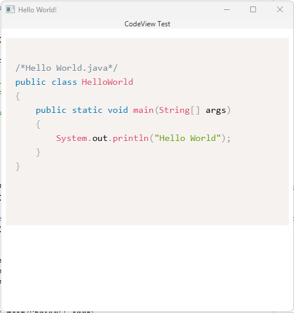

CodeView is a JavaFX node that is used to display code.

The underlying technology behind CodeView is [prismjs](https://prismjs.com/).

Compatible Languages: Java

Note: I created this node to learn how to create custom nodes using Region. I do not have a real-world use case for this control, so I didn't take any steps to make it compatible with more languages. I can add more languages if needed.

Example:

**Main**

    import javafx.application.Application;
    import javafx.scene.Scene;
    import javafx.scene.control.Label;
    import javafx.scene.layout.Priority;
    import javafx.scene.layout.StackPane;
    import javafx.scene.layout.VBox;
    import javafx.stage.Stage;
    import sed.node.control.CodeView;
    
    
    
    public class App extends Application 
    {
        @Override
        public void start(Stage primaryStage) 
        {
            String javaString2 =
                    """
                    /*Hello World.java*/
                    public class HelloWorld
                    {
                        public static void main(String[] args)
                        {
                            System.out.println("Hello World");
                        }
                    }
                    """;
    
            CodeView codeView = new CodeView(javaString2, CodeView.CodeLanguage.JAVA);
            VBox.setVgrow(codeView, Priority.ALWAYS);
    
            VBox root = new VBox(new StackPane(new Label("CodeView Test")), codeView);
            root.setStyle("-fx-background-colo: green");
            Scene scene = new Scene(root, 500, 500);
    
            primaryStage.setTitle("Hello World!");
            primaryStage.setScene(scene);
            primaryStage.show();
        }
    
        public static void main(String[] args) 
        {
            launch();
        }
    }

**module-info**

    module sed.node.control {
        requires javafx.controls;
        requires javafx.web;
        
        exports sed.node.control;
    }

**Output**

     
